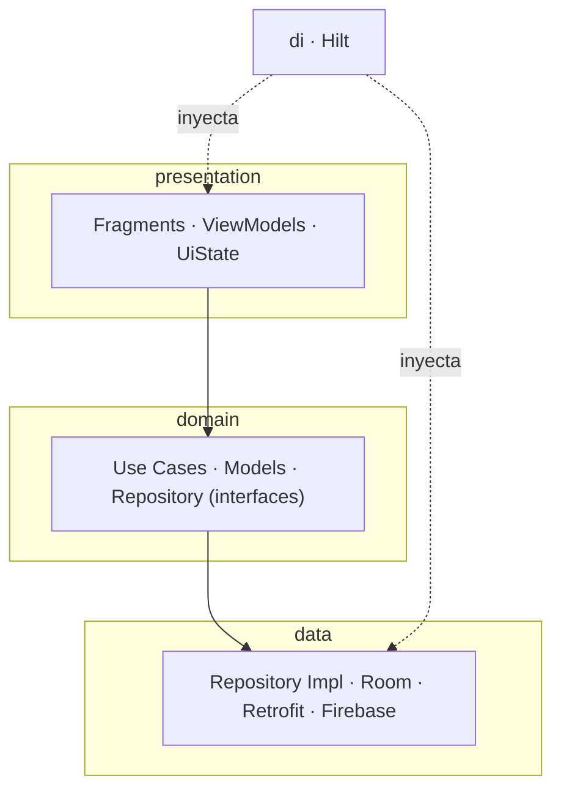

# VideoPlayer-KT

> Reproductor de IPTV para **Android** (Kotlin): listas M3U/M3U8/RPD, canales, favoritos,
> reproducción HLS/DASH y autenticación con backend en la nube.


📱 **También disponible para Apple TV / iPhone** → [VideoPlayer (tvOS/Swift)](https://github.com/Anticlub/VideoPlayer).
Mismo producto, dos ecosistemas nativos.

---

## Capturas

> _Pendiente de añadir (Fase B):_ login, lista de playlists, reproductor y favoritos.
> Capturar con `adb exec-out screencap -p > shot.png` o desde Android Studio (Emulator → Screenshot),
> y un GIF corto de zapping.

<!-- | Login | Playlists | Player |
|---|---|---|
|  |  |  | -->

---

## Features

- 🔐 **Login y registro** con Firebase Authentication (+ pantalla splash).
- ☁️ **Playlists remotas**: descarga, sube y sincroniza tus listas con Firebase Realtime Database.
- 📂 **Listas M3U / M3U8 / RPD**: parser propio, detección automática del tipo de URL.
- 📺 **Canales y favoritos** persistidos en local (Room).
- ▶️ **Reproducción HLS y DASH** con Media3 (ExoPlayer) + gestión de DRM.
- 🧭 Navegación con Navigation Component + Safe Args.

## Paridad de features (tvOS ↔ Android)

| Feature | tvOS | Android |
|---|:---:|:---:|
| Reproducción HLS | ✅ | ✅ |
| Playlists M3U | ✅ | ✅ |
| DRM | ✅ FairPlay | 🚧 Widevine |
| EPG | 🚧 | 🚧 |
| Login + backend | 🚧 | ✅ Firebase |
| Backend compartido | 🚧 | ✅ |
| Tests unitarios | ✅ | 🚧 |
| CI | 🚧 | 🚧 |

Las casillas 🚧 son el roadmap público del proyecto multiplataforma.

## Arquitectura

Clean Architecture en cuatro capas + inyección de dependencias con Hilt.



- **presentation** — `Fragments`, `ViewModels` y estados de UI (`UiState`).
- **domain** — casos de uso, modelos e interfaces de repositorio (sin dependencias de Android).
- **data** — implementaciones: Room (local), Retrofit (M3U remoto), Firebase (auth + playlists).
- **di** — módulos Hilt (`NetworkModule`, `DatabaseModule`, `RepositoryModule`, `FirebaseModule`).

## Stack técnico

Kotlin · Media3 (ExoPlayer HLS/DASH) · Hilt · Room · Retrofit · Firebase (Auth, Realtime DB, Analytics) · Navigation Component · ViewBinding · Coroutines/Flow.

## Puesta en marcha

### 1. Clonar

```bash
git clone https://github.com/Anticlub/VideoPlayer-KT.git
```

### 2. Configurar Firebase

El proyecto usa Firebase para login, listas remotas y analytics. El archivo
`google-services.json` **no está en el repositorio** por seguridad; hay que añadirlo a mano:

1. Solicitar acceso al proyecto Firebase al mantenedor.
2. En [console.firebase.google.com](https://console.firebase.google.com): proyecto → Configuración → Tus apps → Android (`dev.anticlub.videoplayer`).
3. Descargar `google-services.json` y colocarlo en `app/google-services.json`.

### 3. Compilar y testear

```bash
./gradlew assembleDebug          # build
./gradlew testDebugUnitTest      # tests unitarios
```

## Licencia

[MIT](LICENSE) © 2026 Cristofer Fernandez
